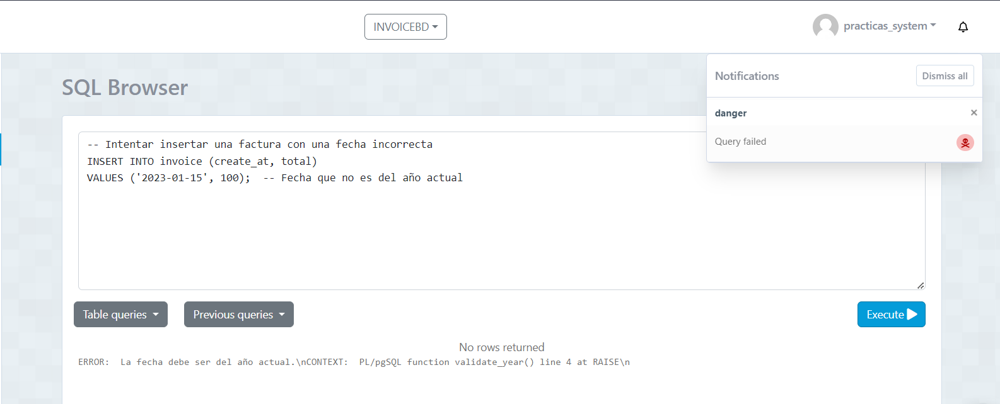

### Funciones y Triggers SQL

#### Validar que el número de cédula tenga 10 números (sin letras)

```sql
-- Función para validar el número de cédula
CREATE OR REPLACE FUNCTION validate_cedula() RETURNS TRIGGER AS $$
BEGIN
    IF NOT (NEW.nui ~ '^\d{10}$') THEN
        RAISE EXCEPTION 'El número de cédula debe tener 10 dígitos.';
    END IF;
    RETURN NEW;
END;
$$ LANGUAGE plpgsql;
```

-- Trigger para aplicar la validación antes de insertar o actualizar en la tabla cliente

```sql
CREATE TRIGGER validate_cedula_trigger
BEFORE INSERT OR UPDATE ON client
FOR EACH ROW
EXECUTE PROCEDURE validate_cedula();
```


-- Disminuir el stock de la tabla product cuando se inserte un nuevo registro en la tabla item

```sql
-- Función para disminuir el stock
CREATE OR REPLACE FUNCTION decrease_stock() RETURNS TRIGGER AS $$
BEGIN
    UPDATE product
    SET stock = stock - NEW.quantity
    WHERE id = NEW.product_id;
    RETURN NEW;
END;
$$ LANGUAGE plpgsql;
```sql
-- Trigger para actualizar el stock después de insertar un nuevo registro en la tabla item
```sql
CREATE TRIGGER decrease_stock_trigger
AFTER INSERT ON item
FOR EACH ROW
EXECUTE PROCEDURE decrease_stock();
```sql


-- Validar que el campo create_at sea del año actual en la tabla invoice
```sql
-- Función para validar el año del campo create_at
CREATE OR REPLACE FUNCTION validate_year() RETURNS TRIGGER AS $$
BEGIN
    IF EXTRACT(YEAR FROM NEW.create_at) <> EXTRACT(YEAR FROM CURRENT_DATE) THEN
        RAISE EXCEPTION 'La fecha debe ser del año actual.';
    END IF;
    RETURN NEW;
END;
$$ LANGUAGE plpgsql;
```sql
-- Trigger para aplicar la validación antes de insertar o actualizar en la tabla invoice
```sql
CREATE TRIGGER validate_year_trigger
BEFORE INSERT OR UPDATE ON invoice
FOR EACH ROW
EXECUTE PROCEDURE validate_year();
```sql

-- Validar que el correo tenga un @ en la tabla client
```sql
-- Función para validar el correo electrónico
CREATE OR REPLACE FUNCTION validate_email() RETURNS TRIGGER AS $$
BEGIN
    IF POSITION('@' IN NEW.email) = 0 THEN
        RAISE EXCEPTION 'El correo electrónico debe contener un @.';
    END IF;
    RETURN NEW;
END;
$$ LANGUAGE plpgsql;
```sql

-- Trigger para aplicar la validación antes de insertar o actualizar en la tabla client
```sql
CREATE TRIGGER validate_email_trigger
BEFORE INSERT OR UPDATE ON cliente
FOR EACH ROW
EXECUTE PROCEDURE validate_email();
```sql

